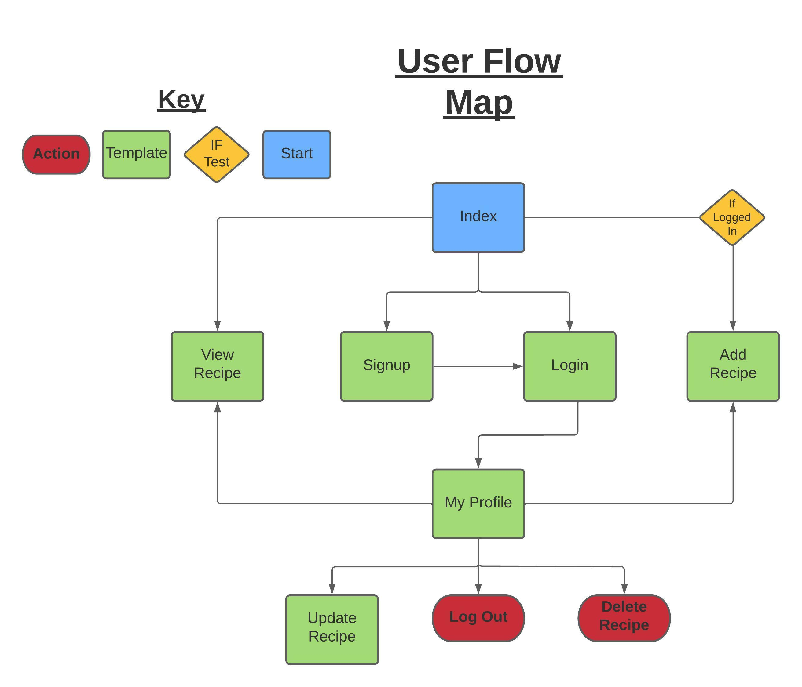

# **Recipease - AMS CRUD Application** by Denis Hayes

 ## **Introduction**
---
### This project has been completed according to the SFIA Framework, to satisfy the deliverable requested by AMS to assess familiarity/competency with the core concepts that have so far been covered within the QA DevOps training program.

 

### The application provides users with a platform on which to host their recipes, share these recipes and browse the recipes uploaded by other users.

 

### The application uses the Flask framework in conjunction with a relational SQL database.

 

 ## **Table of Contents**
---

1. [Introduction](#introduction)
2. [Project Aims](#project-aims)
3. [User Stories](#user-stories)
4. [Planning](#planning)
5. [Risk Assessment](#risk-assessment)
6. [Current Features](#current-features)
7. [Upcoming Features](#upcoming-features)
8. [Known Issues](#known-issues)
9. [Testing](#testing)
10. [Data Structure](#data-structure)
11. [Site Structure](#site-structure)
12. [Design Notes](#design-notes)
13. [Technologies Used](#technologies-used)
14. [Acknowledgments](#acknowledgments)

 ## **Project Aims**
---
### **The aims of the this project are:**
- To create a fully functional CRUD application.
- To sufficiently test the functionality of the application.
- To utilise supporting tools in the creation of the application.
- To apply the learned methodologies to the development process.
- To fully document the process of the application's design.
 

 ## **User Stories**
---
 ## **Planning**
---
The development of this project has been carefully planned and executed according to a Trello Board established for this purpose.

Built in Trello features such as labels and descriptions allow for 'at a glace' understanding of tasks and priorities.

**Read-Only access to the Trello board is available here:
https://trello.com/invite/b/KeJbV393/ATTI7cae7677ff9adf76bd7ff788deaa67b80957613D/tasks**
 ## **Risk Assessment**
---
 ## **Current Features**
---
### **Navigation Bar**
* A fixed-to-top Bootstrap Navbar, is visible on all pages of the site allowing users to easily navigate the different features of the application.
* The Navbar is dynamically populated, meaning that an anonymous user will have access to a different set of navigation options than a logged in user will. This allows for the easy control of the user's movement throughout the website.

### **Intro Section**
* The Intro Section provides the users with the key information needed to understand the main purpose of the website.
* Key words within the Intro Section are highlighted, allowing the user to understand at a glance the main functions of the application.

### **Recipe Cards Section**
* The Recipe Cards Section displays the entire collection of recipes present on the site.
* Each individual recipe is represented by card, which displays the recipe's key information including its name, description, author and the dietary category of the recipe.
* The dietary category of the recipe is indicated with a small icon at the head of the card, which can currently represent the following categories: 'Meat Eater', 'Vegetarian' and 'Vegan'.
* Clicking on a recipe card takes the user to the view_recipe template associated with that recipe.

### **Footer**
* The website displays a basic footer at the end of every page.
* Originally dynamically populated by JavaScript HTML injection, the Footer's content is now hardcoded.

### **Authentication - Sign Up/Login**
* Authentication is handled using the Flask-Login package.
* Users can (and are encouraged to) Sign Up to the website by clicking on the highlighted 'Sign Up' navigation element.
* Upon clicking on the Sign Up navigation element the user is redirected to the Sign Up template, whereupon they will be prompted to enter a username and a password.
* The username and password are validated in the backend. Usernames must be unique, both fields must be of a certain length, and the password is hashed using Bcrypt.
* If the user submits the Sign Up form with a valid username and password, they are redirected to the Login template.
* The user is prompted to enter their Login credentials, and if they successfully do so they are redirected to the 'My Profile' template.
* If logged in, a user can click the Log Out button at any time to end their session, and return their status to that of an anonymous user.

### **Authentication - Login Required**
* Flask-Login provides the Login Required functionality.
* Certain templates and functions within the application are unaccessible to anonymous users. This, in conjunction with other measures, protects the content of the database and the application.

### **Authentication - Content Protection**
* Custom code has been implemented which prevents one logged in user from accessing the content of another user.
* This means that User 1 cannot edit or delete recipes created by User 2.

### **My Profile**
* Upon successful Login, the user is presented with their personal profile template.
* A message, displaying the user's username, welcomes the user, while a sub-heading informs the user of the purpose of the 'My Profile' page.
* If the user has created any recipes, they are displayed within the My Profile template in the same card format as the Index template.
* As with the Index display, clicking on a recipe card takes the user to the view_recipe template associated with that recipe.
* Two buttons are present under each of the user's recipes:
    * The Delete Recipe button allows a user to remove a recipe from the database. This function requires confirmation through the use of a modal, reducing the chances of an accidental deletion.
    * The Edit Recipe button allows the user to access the recipe's update_recipe template, where they can use a form to change any of the data that they have entered in associated with that recipe.

### **Add Recipe**
* By clicking on either the + button in the index or in their profile, a registered and logged in user can access the Add Recipe template.
* The + button is not visible to anonymous users, and the route is protected by the Login Required function.
* The Add Recipe template provides the user with a 2 sided form to complete. The contents of this form, when submitted make up a full recipe entry in the database.
* The fields of the form are validated, and all fields must be filled out before submission can occur.

### **View Recipe**
* By clicking on any recipe card, the user is taken to that recipe card's View Recipe template.
* The view Recipe template displays all of the data associated with its corresponding recipe.
* If the recipe was created by the logged in user viewing it, additional update and delete buttons are present within the left side display.

### **Update Recipe**
* By clicking on the Update Recipe icon present in the Profile template, the user can access the Update Recipe template which allows them to change the data of a recipe that they have created.
* The Update Recipe template is a carbon copy of the Add Recipe template, except in that it is automatically prefilled with a recipe's existing data.

### **Delete Recipe**
* By clicking on a recipe's delete icons (either in the Profile template's recipe display or in the View Recipe template) the user is presented with a modal, asking them to confirm the deletion.
* If the user confirms the deletion within the modal, the data related to that recipe is removed from the database and the user is returned to their Profile template.

 ## **Upcoming Features**
---
### **Separate Instruction/Ingredient Tables**
* Having separate Instruction and Ingredient tables would allow users to enter each of their instructions step by step and each ingredient one by one.
* In their current implementation, the ingredients and instructions sections of the form are somewhat freeform, with their contents being displayed according to the way the user inputs the information.
* This new structure would allow for a homogenised recipe viewing experience
* In this format, additional page styling could present the list of instructions in ordered steps, perhaps with checkboxes for the user to tick as they work their way through the recipe.

### **Recipe Aggregation - Cookbooks**
* Allowing users to aggregate recipes into different collections or 'Cookbooks' would add value to the site.
* Users should simply be able to create a new Cookbook instance, and when viewing a recipe should be able to click a dropdown to add the recipe to any of their existing Cookbooks.

### **Recipe Searching**
* Users should be able to easily search for specific recipes.
* To achieve this, in all areas where a recipe display is present, the user should have access to a search input, which will filter the recipes displayed to match the user's search terms.

### **Additional Diet Categories**
* Currently, the site's recipes are broken into 3 basic dietary categories of 'Meat Eater', 'Vegetarian' and 'Vegan'.
* These categories do not account for the wide variety of dietary categories in the real world and should be expanded upon.

### **Responsivity**
* In its current form, the site is not functional across all screen sizes, having been designed on, and designed for, large desktop monitors.
* In future development, the intention is to update the site to be functional and pleasant to use across a wide variety of screen sizes and ratios.

 ## **Testing**
---
 ## **Known Issues**
---
### **Button Edges Unresponsive**
* Presently, some of the site's buttons do not register a click event if the user clicks on the very outward edge.
* Buttons affected: Add Recipe Button, Edit Recipe Button, Delete Recipe Button
* This unintended occurrence is repeatable, but not of a severity that would hamper the user's experience. In fact, it is unlikely that the user would identify the problem unless looking for it.
* This issue can be fixed by restructuring the layout of the affected button's HTML, and then updating the CSS to take the changes into account.
### **Lack of Responsivity**
* In its current form, the site is not functional across all screen sizes, having been designed on and for large desktop monitors.
* This issue can be fixed by adding media queries to the various site elements, resizing and removing elements to improve the small screen experience.
 ## **Data Structure**
---
 ## **Site Structure**
---
### **Layout:**
* The site has been designed with simplicity of navigation at the forefront of concerns.
* The main Navigation Bar is present at the head of every page, allowing the user to easily identify and move between the different sections of the site.
* The Index template has been designed to inform a new user of the purpose of the site, with careful highlighting to draw the eye to different important information/buttons.

### **User Flow Map**
The following User Flow Map describes the layout of the site and the expected paths that a user may take.

 

 

 ## **Design Notes**
---
 ## **Technologies Used**
---
### **Flask**
* The Flask micro-framework has been used to create this application.
* Flask provides built-in templating, routing and WSGI.
* Flask can be extended using a variety of packages, which proved instrumental in the development of this application.

### **Flask-Login**
* Flask-Login provides the basis for the site's authentication functionalities.
* Pre-built Signup and Login functionality, as well as the hashing of passwords using Bcrypt, allows for the safe and hassle-free registration of new users to the site.
* Flask Login allows for the gating of content depending on a user's authentication status, a feature used to protect the database from unauthorised access.

### **SQLite**
* SQLite provides an in-memory database for use in a non-production environment. 
* In the event that this project was to be used in production environment, an alternative database solution would be required.

### **SQLAlchemy**
* SQLAlchemy is the library used that served as the Object Relational Mapping tool, which translate Python classes to tables within the database.

### **WTForms**
* WTForms is the library used to render the forms into which users input their data.
* This library features CSRF protection and data validation, both of which secure the contents of the database.

### **Github**
* The version control of this project is handled by GitHub.
* Using Github and its GUI makes perfomring Git actions more visual and straightforward, allowing easy identification of key information at a glance.

### **GitPod**
* GitPod was the IDE used during the development of this project.
* Essentially a cloud based version of VS Code, GitPod allows for great mobility and flexibility, being usable on almost any device.

### **Font Awesome**
* Font Awesome is used to provide the iconography of the site.
* Font Awesome's functionality is served via a CDN.

### **Trello**
* Trello was used throughout the project to keep track of the various tasks to be completed in the realisation of the work.

### **Figma**
* Figma was used to create high fidelity design mockups of the site's templates. 

### **Balsamiq**
* Balsamiq was used to create low fidelity wireframes of the site's templates. 

 ## **Acknowledgments**
---
### My sincere thanks to the following people and groups; I greatly appreciate the assistance and support that they provided during the development of this app.

 

* Adam Gray - QA Instructor
* Earl Gray - QA Instructor
* Leon Robinson - QA Instructor
* Jacqueline Adams - AMS Senior Recruiter
* Team Magenta - My Peers